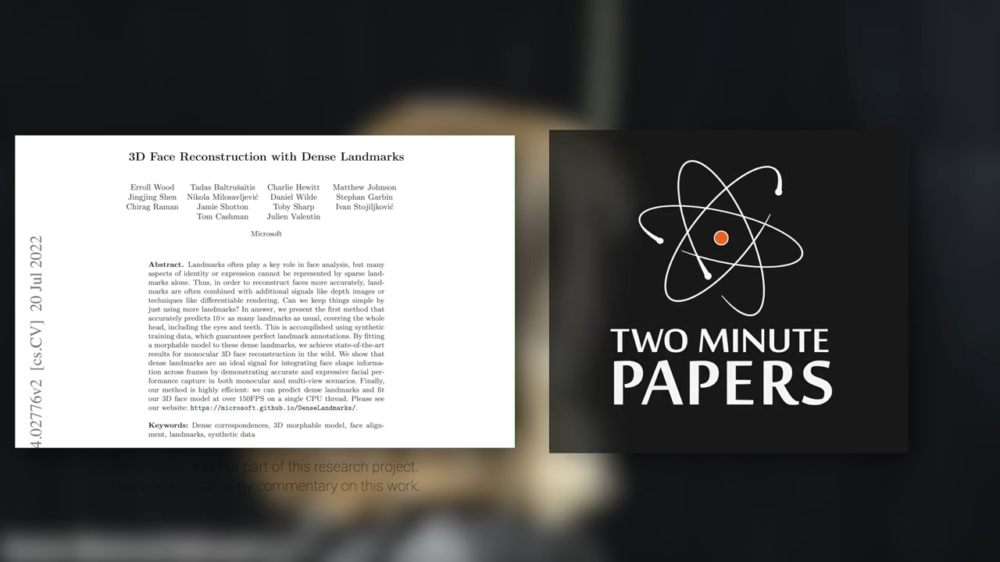

## Computer Vision

### Dense Landmarks

<https://microsoft.github.io/DenseLandmarks/>

## Piano

### Dvorak Humoresque 1 Opus 101

## Repositories

<https://github.com/danielwilde>

## Game Dev

<https://en.wikipedia.org/wiki/Grand_Theft_Auto_V>
<https://en.wikipedia.org/wiki/The_Outsider_(video_game)>
<https://en.wikipedia.org/wiki/Star_Wars:_Battlefront#Star_Wars:_Battlefront_III>
<https://en.wikipedia.org/wiki/Harry_Potter_and_the_Goblet_of_Fire_(video_game)>
<https://en.wikipedia.org/wiki/Burnout_Paradise>

## Academia

<https://ori.ox.ac.uk/>
<https://www.epcc.ed.ac.uk/>

